# Entity-Relationship Diagram (ERD) & Database Schema — SIMRS Mini

> **Versi:** 1.0 · **Standar:** Frappe Healthcare v15 & SatuSehat FHIR Kemenkes RI  
> **Lokasi Project:** `/home/rakha/Documents/intern/simrs_prototype_dau` & `clinic_satusehat`  
> **Tanggal:** 2026-10-09  

---

## 1. Diagram ERD Sistem (Mermaid)

```mermaid
erDiagram
    %% ====================================================
    %% MASTER DATA ENTITIES
    %% ====================================================
    PATIENT {
        varchar name PK "No. Pasien (PAT-001)"
        varchar mr_no UK "No. Rekam Medis (RM-2026-xxxx)"
        varchar nik UK "NIK 16 Digit"
        varchar patient_name "Nama Lengkap"
        date birth_date "Tanggal Lahir"
        enum gender "Laki-laki / Perempuan"
        varchar phone "No. HP / WA"
        text address "Alamat Domisili"
        varchar blood_group "Golongan Darah (O+, A+, B+, AB+)"
        varchar default_payer "Umum / BPJS / Asuransi"
        varchar satusehat_ihs_id "ID Pasien SatuSehat Kemenkes"
    }

    HEALTHCARE_PRACTITIONER {
        varchar name PK "ID Dokter (DOC-HENDRA)"
        varchar practitioner_name "Nama Lengkap & Gelar"
        varchar department FK "Link Medical Department"
        varchar mobile_phone "No. Kontak"
        varchar satusehat_practitioner_id "IHS ID Dokter Kemenkes"
    }

    MEDICAL_DEPARTMENT {
        varchar name PK "Kode Poli (POLI-INT, POLI-ANAK)"
        varchar department_name "Nama Poliklinik"
        varchar room_number "Ruangan (Ruang 101, Lantai 1)"
        varchar queue_prefix "Prefix Antrian (A, B, C, D, E)"
        varchar satusehat_location_id "Location ID SatuSehat"
    }

    ITEM {
        varchar name PK "Kode Item (MED-001 / SRV-CONS)"
        varchar item_name "Nama Obat / Jasa Tindakan / Lab"
        enum item_group "Obat Formularium / Jasa Medis / Lab"
        decimal standard_rate "Tarif Standar (IDR)"
        varchar kfa_code "Kode KFA Kemenkes (Khusus Obat)"
    }

    MEDICAL_CODE {
        varchar name PK "Kode ICD (I10, E78.5)"
        varchar code_value "Kode Standar ICD-10 / ICD-9-CM"
        varchar description "Nama Diagnosa / Penyakit"
    }

    %% ====================================================
    %% CENTRAL ORCHESTRATOR ENTITY
    %% ====================================================
    OUTPATIENT_VISIT {
        varchar name PK "ID Random Unique (REG-WALK-B8K21)"
        varchar patient FK "Link Patient"
        varchar mr_no "Snapshot No. RM"
        varchar department FK "Link Medical Department"
        varchar practitioner FK "Link Healthcare Practitioner"
        datetime registered_at "Waktu Registrasi Loket"
        enum registration_source "Walk-in / Online Booking"
        enum payer_type "Umum / BPJS / Asuransi / Perusahaan"
        enum payment_sub_method "Cash / Credit / QRIS / VA"
        varchar payer_member_no "No. Kartu BPJS / Polis Asuransi"
        varchar sep_no "No. SEP BPJS (Jika Ada)"
        enum visit_status "REGISTERED / WAITING_TRIAGE / WAITING_DOCTOR / IN_SERVICE / CLOSED"
        varchar ticket_no "Nomor Tiket Antrian Aktif"
    }

    %% ====================================================
    %% CLINICAL & MEDICAL RECORD ENTITIES
    %% ====================================================
    VITAL_SIGNS {
        varchar name PK "ID TTV (VS-2026-xxxxx)"
        varchar visit FK "Link Outpatient Visit (1-to-1)"
        varchar patient FK "Link Patient"
        int systolic "Tekanan Darah Sistol (mmHg)"
        int diastolic "Tekanan Darah Diastol (mmHg)"
        int bp_pulse "Denyut Nadi (x/mnt)"
        float temperature "Suhu Badan (C)"
        int respiratory_rate "Laju Napas (x/mnt)"
        int spo2 "Saturasi Oksigen (%)"
        float height "Tinggi Badan (cm)"
        float weight "Berat Badan (kg)"
        float bmi "Indeks Massa Tubuh"
        text chief_complaint "Keluhan Utama Triase"
        int pain_score "Skala Nyeri VAS (0-10)"
        enum fall_risk "Rendah / Sedang / Tinggi"
        varchar satusehat_obs_id "UUID Observation SatuSehat"
    }

    PATIENT_ENCOUNTER {
        varchar name PK "ID SOAP (ENC-2026-xxxxx)"
        varchar visit FK "Link Outpatient Visit (1-to-1)"
        varchar patient FK "Link Patient"
        varchar practitioner FK "Link Healthcare Practitioner"
        datetime encounter_date "Waktu Pemeriksaan"
        text subjective "Anamnesis / Keluhan Pasien"
        text objective "Temuan Fisik Dokter"
        text assessment "Penilaian Klinis"
        text plan "Instruksi & Rencana Terapi"
        boolean is_finalized "Status Kunci Rekam Medis (1/0)"
        datetime finalized_at "Waktu Finalisasi SOAP"
        varchar satusehat_encounter_id "UUID Encounter SatuSehat"
    }

    ENCOUNTER_DIAGNOSIS {
        varchar name PK "Child Row ID"
        varchar parent FK "Link Patient Encounter"
        varchar diagnosis_code FK "Link Medical Code (ICD-10)"
        varchar diagnosis_name "Nama Diagnosa ICD-10"
        boolean is_primary "Diagnosa Utama (1/0)"
        varchar satusehat_condition_id "UUID Condition SatuSehat"
    }

    ENCOUNTER_PROCEDURE {
        varchar name PK "Child Row ID"
        varchar parent FK "Link Patient Encounter"
        varchar procedure_item FK "Link Item (Jasa Medis)"
        varchar procedure_name "Nama Tindakan Medis"
        decimal price "Tarif Tindakan"
        varchar satusehat_procedure_id "UUID Procedure SatuSehat"
    }

    LAB_TEST {
        varchar name PK "ID Lab (LAB-2026-xxxxx)"
        varchar visit FK "Link Outpatient Visit"
        varchar patient FK "Link Patient"
        varchar practitioner FK "Dokter Pengirim"
        varchar test_item FK "Link Item (Paket Lab)"
        text result_summary "Hasil Uji Laboratorium"
        enum test_status "Pending / In Progress / Completed"
        varchar satusehat_report_id "UUID DiagnosticReport SatuSehat"
    }

    MEDICATION_REQUEST {
        varchar name PK "ID Resep (MEDREQ-2026-xxxxx)"
        varchar visit FK "Link Outpatient Visit"
        varchar patient FK "Link Patient"
        varchar encounter FK "Link Patient Encounter"
        varchar practitioner FK "Dokter Penulis Resep"
        enum request_status "Active / Completed / Cancelled"
    }

    MEDICATION_REQUEST_ITEM {
        varchar name PK "Child Row ID"
        varchar parent FK "Link Medication Request"
        varchar medication_item FK "Link Item (Obat Formularium)"
        varchar dosage "Dosis Aturan Pakai (1x1 tablet)"
        int quantity "Jumlah Obat"
        varchar instruction "Instruksi (Sesudah Makan)"
        varchar satusehat_medreq_id "UUID MedicationRequest SatuSehat"
    }

    MEDICATION_DISPENSE {
        varchar name PK "ID Dispense (DISP-2026-xxxxx)"
        varchar medication_request FK "Link Medication Request"
        varchar visit FK "Link Outpatient Visit"
        varchar dispensed_by FK "Petugas Farmasi / Apoteker"
        boolean verified_7_benar "Verifikasi 7 Benar (1/0)"
        enum dispense_status "Draft / Prepared / Dispensed"
        varchar satusehat_dispense_id "UUID MedicationDispense SatuSehat"
    }

    %% ====================================================
    %% BILLING & QUEUE ENTITIES
    %% ====================================================
    SALES_INVOICE {
        varchar name PK "No. Kwitansi (KWT-2026-xxxxx)"
        varchar visit FK "Link Outpatient Visit (1-to-1)"
        varchar patient FK "Link Patient"
        decimal total_amount "Total Biaya Riil (IDR)"
        decimal covered_amount "Tanggungan BPJS/Asuransi (IDR)"
        decimal patient_pay_amount "Wajib Dibayar Pasien (IDR)"
        enum payment_method "Cash / Credit / QRIS / VA"
        enum status "Draft / Paid / Cancelled"
        datetime paid_at "Waktu Pelunasan Kasir"
    }

    QUEUE_TICKET {
        varchar name PK "ID Tiket (TKT-2026-xxxxx)"
        varchar visit FK "Link Outpatient Visit"
        varchar ticket_number "Nomor Antrian (A-001, T-003, K-002)"
        enum queue_station "Triase / Poli / Kasir / Farmasi"
        enum ticket_status "Menunggu / Dipanggil / Selesai / Lewat"
        datetime called_at "Waktu Terakhir Dipanggil"
    }

    %% ====================================================
    %% RELATIONSHIPS & CARDINALITY
    %% ====================================================
    PATIENT ||--o{ OUTPATIENT_VISIT : "mendaftar"
    HEALTHCARE_PRACTITIONER ||--o{ OUTPATIENT_VISIT : "memeriksa"
    MEDICAL_DEPARTMENT ||--o{ OUTPATIENT_VISIT : "tujuan poli"
    HEALTHCARE_PRACTITIONER }o--|| MEDICAL_DEPARTMENT : "bertugas di"

    OUTPATIENT_VISIT ||--o| VITAL_SIGNS : "merekam TTV"
    OUTPATIENT_VISIT ||--o| PATIENT_ENCOUNTER : "pemeriksaan medis"
    OUTPATIENT_VISIT ||--o{ LAB_TEST : "order penunjang"
    OUTPATIENT_VISIT ||--o{ MEDICATION_REQUEST : "resep obat"
    OUTPATIENT_VISIT ||--o| SALES_INVOICE : "pembayaran kasir"
    OUTPATIENT_VISIT ||--o{ QUEUE_TICKET : "tiket antrian"

    PATIENT_ENCOUNTER ||--o{ ENCOUNTER_DIAGNOSIS : "memiliki diagnosa"
    PATIENT_ENCOUNTER ||--o{ ENCOUNTER_PROCEDURE : "memiliki tindakan"
    ENCOUNTER_DIAGNOSIS }o--|| MEDICAL_CODE : "kode ICD-10"
    ENCOUNTER_PROCEDURE }o--|| ITEM : "tarif tindakan"

    MEDICATION_REQUEST ||--o{ MEDICATION_REQUEST_ITEM : "rincian obat"
    MEDICATION_REQUEST_ITEM }o--|| ITEM : "master obat"
    MEDICATION_REQUEST ||--o| MEDICATION_DISPENSE : "dilayani apotek"
```

---

## 2. Rincian Spesifikasi Tabel (DocTypes)

### 2.1 Master Data

#### `Patient` (Native Healthcare DocType)
*Menyimpan data master rekam medis pasien.*
* **Primary Key:** `name` (`PAT-001`, `PAT-002`)
* **Unique Constraints:** `mr_no` (Nomor RM unik), `nik` (NIK 16 digit terverifikasi Dukcapil)
* **Field Penting:** `patient_name`, `birth_date`, `gender`, `phone`, `address`, `blood_group`, `default_payer`, `satusehat_ihs_id`.

#### `Healthcare Practitioner` (Native Healthcare DocType)
*Menyimpan data dokter spesialis dan tenaga medis pemeriksa.*
* **Primary Key:** `name` (`DOC-HENDRA`, `DOC-ANISA`)
* **Foreign Key:** `department` ➔ `Medical Department`
* **Field Penting:** `practitioner_name`, `mobile_phone`, `satusehat_practitioner_id`.

#### `Medical Department` (Native Healthcare DocType)
*Menyimpan data poliklinik rawat jalan dan ruangan.*
* **Primary Key:** `name` (`POLI-INT`, `POLI-ANAK`, `POLI-GIGI`, `POLI-BEDAH`, `POLI-SARAF`, `POLI-MATA`)
* **Field Penting:** `department_name`, `room_number`, `queue_prefix` (`A`, `B`, `C`, `D`, `E`, `F`), `satusehat_location_id`.

---

### 2.2 Entitas Sentral Transaksi

#### `Outpatient Visit` (Custom DocType)
*Orkestrator alur hidup kunjungan pasien hari ini.*
* **Primary Key:** `name` (Format unik random: `REG-WALK-[5 Alphanumeric]`, contoh `REG-WALK-B8K21`)
* **Foreign Keys:**
  * `patient` ➔ `Patient`
  * `department` ➔ `Medical Department`
  * `practitioner` ➔ `Healthcare Practitioner`
* **Field Operasional & Finansial:**
  * `registered_at` (Datetime stempel waktu kedatangan)
  * `registration_source` (`Walk-in`, `Online Booking`, `Rujukan`)
  * `payer_type` (`Umum`, `BPJS`, `Asuransi`, `Perusahaan`)
  * `payment_sub_method` (`Cash`, `Credit`, `QRIS`, `VA` — khusus pasien Umum)
  * `payer_member_no` (No. Kartu BPJS / Polis)
  * `sep_no` (Nomor Surat Eligibilitas Peserta BPJS)
  * `visit_status` (`REGISTERED`, `WAITING_TRIAGE`, `IN_TRIAGE`, `WAITING_DOCTOR`, `IN_SERVICE`, `WAITING_RESULTS`, `SERVICE_COMPLETED`, `CLOSED`, `CANCELLED`)
  * `ticket_no` (Nomor antrian aktif)

---

### 2.3 Entitas Klinis & Rekam Medis (EMR)

#### `Vital Signs` (Native Healthcare + Custom Fields)
*Rekam skrining triase awal dan tanda-tanda vital oleh perawat.*
* **Primary Key:** `name` (`VS-2026-00001`)
* **Foreign Key:** `visit` ➔ `Outpatient Visit` (1-to-1)
* **Field Klinis:** `systolic`, `diastolic`, `bp_pulse`, `temperature`, `respiratory_rate`, `spo2`, `height`, `weight`, `bmi`, `chief_complaint`, `pain_score`, `fall_risk`, `satusehat_obs_id`.

#### `Patient Encounter` (Native Healthcare DocType)
*Rekam medis SOAP dokter spesialis.*
* **Primary Key:** `name` (`ENC-2026-00001`)
* **Foreign Key:** `visit` ➔ `Outpatient Visit` (1-to-1), `practitioner` ➔ `Healthcare Practitioner`
* **Field SOAP:** `subjective` (Anamnesis), `objective` (Temuan Fisik), `assessment` (Penilaian), `plan` (Instruksi), `is_finalized` (1/0 pengunci rekam medis), `finalized_at`, `satusehat_encounter_id`.
* **Child Tables:**
  * `Encounter Diagnosis` (`diagnosis_code` ➔ `Medical Code` ICD-10, `is_primary`, `satusehat_condition_id`)
  * `Encounter Procedure` (`procedure_item` ➔ `Item`, `price`, `satusehat_procedure_id`)

#### `Lab Test` (Native Healthcare DocType)
*Order penunjang laboratorium dan hasil evaluasi klinis.*
* **Primary Key:** `name` (`LAB-2026-00001`)
* **Foreign Key:** `visit` ➔ `Outpatient Visit`, `test_item` ➔ `Item`
* **Field:** `result_summary`, `test_status` (`Pending`, `Completed`), `satusehat_report_id`.

#### `Medication Request` & `Medication Dispense` (Apotek)
*Resep obat dari dokter dan proses dispensing apoteker.*
* **Foreign Keys:** `visit` ➔ `Outpatient Visit`, `encounter` ➔ `Patient Encounter`
* **Child Table:** `Medication Request Item` (`medication_item` ➔ `Item`, `dosage`, `quantity`, `instruction`, `satusehat_medreq_id`)
* **Dispense:** `verified_7_benar` (1/0), `dispense_status` (`Dispensed`), `satusehat_dispense_id`.

---

### 2.4 Entitas Kasir & Antrian

#### `Sales Invoice` (Native ERPNext DocType)
*Kwitansi dan pelunasan kasir.*
* **Primary Key:** `name` (`KWT-2026-84721`)
* **Foreign Key:** `visit` ➔ `Outpatient Visit` (1-to-1)
* **Field Finansial:** `total_amount` (Biaya riil), `covered_amount` (Klaim BPJS 100% / Asuransi 85%), `patient_pay_amount` (Sisa bayar), `payment_method` (`Cash`, `Credit`, `QRIS`, `VA`), `status` (`Paid`).

#### `Queue Ticket` (Custom Antrian DocType)
*Pengelolaan nomor antrian antarmuka stasiun layanan.*
* **Primary Key:** `name` (`TKT-2026-00001`)
* **Foreign Key:** `visit` ➔ `Outpatient Visit`
* **Field:** `ticket_number` (Contoh: `A-001`, `T-003`, `K-002`, `F-001`), `queue_station`, `ticket_status` (`Menunggu`, `Dipanggil`, `Selesai`), `called_at`.

---

## 3. Matriks Integritas & Pemetaan SatuSehat FHIR v4

| Entitas SIMRS (Frappe) | Resource FHIR Kemenkes | Kunci Relasi Utama | Trigger Sinkronisasi |
|---|---|---|---|
| `Patient` | `Patient` | `satusehat_ihs_id` | Verifikasi NIK saat registrasi |
| `Healthcare Practitioner` | `Practitioner` | `satusehat_practitioner_id` | Master Data Dokter |
| `Medical Department` | `Location` | `satusehat_location_id` | Master Data Poliklinik |
| `Outpatient Visit` | `Encounter (Arrived)` | `satusehat_encounter_id` | Check-in / Pendaftaran Walk-in |
| `Vital Signs` | `Observation` (TTV) | `satusehat_obs_id` | Simpan Skrining Triase |
| `Encounter Diagnosis` | `Condition` (ICD-10) | `satusehat_condition_id` | Finalisasi SOAP Dokter |
| `Encounter Procedure` | `Procedure` (ICD-9-CM)| `satusehat_procedure_id` | Finalisasi Tindakan Medis |
| `Medication Request Item` | `MedicationRequest` | `satusehat_medreq_id` | Finalisasi Resep Obat |
| `Medication Dispense` | `MedicationDispense` | `satusehat_dispense_id` | Penyerahan Obat Apotek |
| `Lab Test` | `DiagnosticReport` | `satusehat_report_id` | Verifikasi Hasil Uji Lab |
